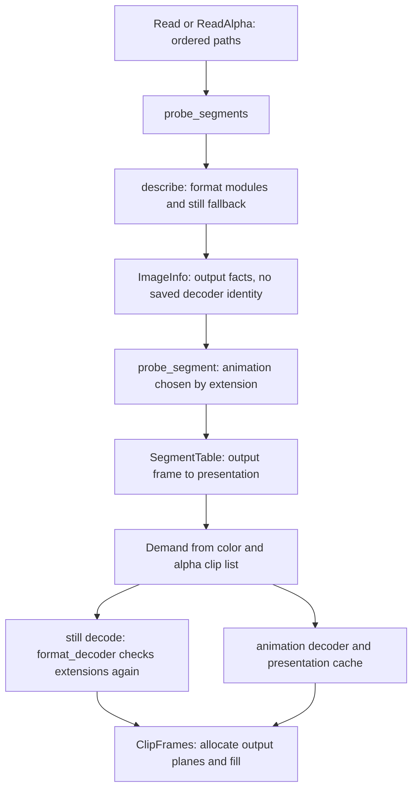

# input routing, probing and planar decoding

Status: research complete; **implementation partly landed, plan still open**.
Content-based still/animation routing and image-rs removal are landed. Saved
decoder plans, shared input sessions and further planar/I/O work remain open.

Inspected and reproduced on 2026-10-04, starting at commit
`5fe603dc7501c14b23266992deb364b780961dc1` (0.2.1). The checkout was clean
before the research. Experiments and logs are confined to ignored `target/`.

The inventory and reproductions describe the initial snapshot. During closing
checks, concurrent edits appeared in `src/decoder.rs` and `src/formats/bmp.rs`
adding a BMP row path, and the release DLL had a different hash. Those edits
were preserved. The new BMP path still uses a header-prefix preparation followed
by a whole-file read in `fill`, so the shared-reader recommendation also applies
to it. The closing measurements are a separate snapshot, not a controlled
before/after comparison.

## current implementation status — 2026-10-04

Re-audited at `5a2467e` after the routing and image-rs changes. This status
section describes the current tree; the original inventory, reproductions and
benchmarks below describe the earlier research snapshot and remain as evidence.
This documentation update implements no decoder changes.

| original phase | current status | remaining work |
| --- | --- | --- |
| 1. Consistent routing, saved plan and sample/subimage invariants | **Content-routing slice landed, and the route is saved and threaded.** `2b02f64` routes stills by content, `c206944` does the same for animation, and the saved-route slices record what the router named on `ImageInfo` and pass it to every module's probe entry, so a file is identified with one read. EXR selection, PAM word width and TIFF metadata/sample handling have also received fixes. | `ImageInfo` saves an icon's selected directory entry as `subimage`, and the decode reads that entry instead of scoring the directory again; the EXR part and the heif/avif backend are *stated* as the same predicate by the probe and the decode rather than saved as an index, because the `exr` crate selects a layer by its channels and has no by-index form, and `exr.rs`'s `the_part_the_probe_chose_is_the_part_that_is_decoded` pins that agreement, while `ico.rs`'s `the_probe_records_the_entry_its_decode_reads` pins what a saved index buys, and the broader error/sample invariants now have their own check: `target/bench/probe-agreement.py` asks every fixture and the step-5 corpus whether anything is described as readable and then refused, and names the two files whose *raster* is what is wrong rather than a header, so a new promise broken by a well-formed file fails it. |
| 2. Combine metadata passes | **Partly landed: the front of the file answers, and a timeline is not rendered to describe it.** PNG, GIF and WebP no longer require image-rs for metadata or fallback pixels; a webp's or jpeg xl's animation adapter answers from the file header, a jpeg 2000 probe reads a window over the front that grows only while the header is incomplete, an avif or heif sequence walk seeks over media data rather than reading it, and an animated png's delays come from its own `fcTL` chunks instead of a rendered frame each. | One shared probe reader is not implemented, and the first thing it needs is a measure: an animated file's *routing* head read is already one (`decoder.rs`'s `an_animation_probe_reads_the_routing_head_once`), so the reads left to unify are the fronts a *format* reads for itself to find a timeline -- `apng`'s chunk walk, `webp`'s RIFF window -- which do not go through `identify::head_of` and are therefore invisible to the counter the routing work uses. They are `apng.rs`'s `timing`, `gif.rs`'s `timings`, `webp.rs`'s `header_states_animation` and the avif/heif sequence walk, each of which opens the file for itself, so the first step of this slice is a counter beside `identify::head_reads` for those, then the reader they would share. That counter now exists -- `animation::timeline_reads`, beside `identify::head_reads`, bumped by `apng::timing`, `gif::timings` and `webp::header_states_animation` -- so what is left of the measuring step is the sequence walk's call site and an assertion in a probe test that reads the number for a real animated file. |
| 3. Retain initialized readers and preserve planes | **Mostly landed.** Eligible PNG, binary RGB8 PNM/PAM, TGA and BMP have row sinks; TIFF has a native YCbCr plane path (`8cf7b06`) and hands a planar RGB page over as the planes it already is rather than interleaving it; and the netpbm, targa and bitmap sinks keep the reader their preparation opened and read one row at a time instead of buffering the file. | PNG initializes a reader again in `fill`. True farbfeld/PNM row reads, direct EXR planes and shared initialized decode state remain open, and the planes a planar page is split into could still be read in place rather than copied. |
| 4. Timing and selected subtype repairs | **Partly complete, and the timing repairs plus two subtypes have landed.** BigTIFF/RGBE recognition, PAM MAXVAL interpretation, TIFF orientation/ICC and EXR flat-RGB part selection have landed; an APNG's timeline is placed on the lowest common denominator of the fractions it states rather than on rounded milliseconds; an animation segment contributes the output sample instants before its end rather than the whole output ticks it covers; a DirectDraw surface whose size is not a whole number of blocks is read with the pixels that hang over its edge clipped; and a netpbm whose header outruns the window it was read through is read, growing that window while the parse needs more. Palette and CMYK(A)/YCbCr TIFF coverage has since expanded too. | Core BMP still has its inspected restriction. Other coverage candidates require individual decisions and evidence. |
| 5. Remove image-rs | **Landed.** `d431764` removes `image`, `8682c2f` removes leftover layout helpers, and `src/still.rs` is deleted. Cargo.toml and Cargo.lock contain no `image` dependency. | This does not finish phases 1–4. Ported code's notices remain applicable; codec dependencies such as libwebp are independent of image-rs. |

`identify::route` has one production caller in each direction now: `describe`
saves what it named on `ImageInfo`, `probe_segment` reads that route for the
timeline decision, and `format_decoder` reads it for the decode. What remains is
the rest of the saved plan -- the backend and the selected subimage -- and the
per-module ownership guard, which still opens the file to confirm what the
router already decided.

### the saved route, and what still reads the head

`ImageInfo` carries the container `identify::route` named, so the timeline
decision and the decode no longer read the head to reach an answer the probe
already had. `identify::route_agrees` is how a guard uses it: a saved route
answers without a read, and `None` -- an `ImageInfo` built by hand -- falls back
to the head, so a caller that did not come through a probe behaves as before.

`identify::head_reads()` counts the reads on one thread, and two `decoder` tests
pin them for `alpha-rgb8.png`. The before column is what the call sites did; the
after column is what the test counts.

| step | before | after |
| --- | --- | --- |
| one png probe | 4 | 1 |
| one png decode | 2 | 0 |

The route is the only read a probe makes now: `describe` passes it to the module
the router chose, and `image_info` answers the ownership question from it. `None`
is a caller that never routed the file -- a module test, say -- and falls back to
the leading bytes, so nothing that skips the router behaves differently.

The same paired protocol on the 1860 entry cohort this bench uses reads 0.128 ms
a file against 0.188 before these slices, seven blocks of four reps a side and
one-sided in every block. That is 32% less work a file, and it leaves clip
creation 1.03x per file against the installed pre-branch build where reading the
bytes cost 1.53x.

### routing acceptance and the 84 → 76 cohort change

The current release snapshot passed **0 of 76** differing renamed copies in
`tests/routing.py`. That is 19 selected source extensions, four copies per
source (`.bmp`, `.jpg`, `.dat` and the source's uppercase suffix).
The separate timeline check passed **0 of 7** renamed animations differing in
frame count, first-frame bytes or `ImgSeq` properties. This independently
checks the animation dispatch change; `routing.py` itself only asks for frame 0.

The historical **59 of 84** is not a directly comparable before/after cohort.
`2b02f64` changes the selector to exclude signatureless TGA and ambiguous ICO
renames, plus non-image ICC files. With the current fixtures, excluding TGA
and ICO removes four copy cases each, explaining 84 → 76. ICC is excluded as
a non-image source; it must not be counted as an image routing failure.
Those exclusions are intentional limits of this content-routing check, not
proof that those formats now pass arbitrary rename tests. TGA/ICO/CUR require
extension-assisted structural handling and their own controls.

Zero is the acceptance target for the **selected, identified cohort**, and it
is met. Keep the historical result as a labeled earlier measurement rather
than rewriting it to 76 or claiming an equal-cohort 59 → 0 improvement. Any
future performance or coverage comparison needs the same source files,
rename list and fixture bytes on both binaries.

The test does not cover every promised plan invariant: it samples one fixture
per extension and frame 0, compares `ImgSeq` properties rather than every color
property or opt-in ICC payload, and uses `.dat` rather than a no-suffix copy.
Saved backend/item identity, changed-file validation, all animation frames,
missing-extension and ambiguous-format cases need their own acceptance checks.

### clip creation, paired on preserved binaries

The closing note below asks for alternating runs of preserved binaries over one
file list. `target/bench/route-cost.py` does that, and both sides print how many
files they described, so a comparison can be seen to be over the same set.

Seven interleaved pairs over `tests/fixtures`, 187 files accepted by both sides:

| build | median | per file |
| --- | --- | --- |
| `vs-imageseqs-preroute.dll` | 68.5 ms | 0.368 ms |
| `vs-imageseqs-route.dll` | 35.8 ms | 0.191 ms |

Every pair was one-sided, so the routing slice is the 1.91x it claims to be --
against the branch's own interim build, which is not a build anyone has.

The installed `.venv` library is. It was built 2026-10-03 15:47, before any of the
work this plan is about, and it dispatches by extension: `tests/routing.py` reads
**12 of 76** renamed copies differently through it, where both branch builds read
**0 of 76**. Describing the 186 fixture files it and the current build both accept,
replicated tenfold so 0.15 ms a file clears this machine's noise floor:

| build | median, 1860 entries | per file |
| --- | --- | --- |
| installed, pre-branch | 254.8 ms | 0.137 ms |
| current `target/release` | 388.9 ms | 0.209 ms |

Seven blocks of four reps a side, 28 samples each, no overlap: reading bytes
rather than trusting a name cost 1.53x a file there. Both saved-route slices
have since taken the duplicate head reads out, and the same pairing is 1.03x
(`target/bench/route-time-release-021-vs-threaded.txt`). The replication is not
decoration: the same binary over the same work read 20.2 ms in one run and
33.6 ms in another at this scale.

The webp and jpeg xl corpora are the other end of the scale: 35 files of 146 MiB
and 35 of 174 MiB, nearly all of it in a few large pictures, where clip creation
read every one of them whole to ask whether it displays a timeline. Asking the
file header instead takes the same paired protocol from 99 ms to 6 ms and from
157 ms to 5 ms, 17x and 35x, one-sided in every block
(`target/bench/clip-webp-header.txt`, `target/bench/clip-jxl-header.txt`).

Jpeg 2000 is the third, and its probe read the whole file: 35 files of 251 MiB
cost a median of 159 ms and now cost 4 ms, 36x, one-sided in every block
(`target/bench/clip-jp2-window.txt`). The first window implementation demanded
that the codestream box fit inside it, which grew the window to the whole file
and made the probe 4.5x *slower* -- the walk now stops at the `SIZ` a
description reads from the codestream and never asks for the rest of that box.

Avif and heic are the last of these, and there the walk could not simply stop at
a box that runs past what it read: a movie box may follow the media data it
describes, so stopping early would lose a timeline. It seeks over a payload it
does not read instead, which finds a `moov` on either side of an `mdat`: 35 avif
files of 126 MiB went from 84 ms to 6 ms, and 35 heic files of 236 MiB from
170 ms to 13 ms, one-sided in every block
(`target/bench/clip-avif-seekwalk.txt`, `target/bench/clip-heic-seekwalk.txt`).

An animated png states its delays in its `fcTL` chunks and they were read by
rendering every frame: five 1024x1024 files of eight frames went from 49 ms to
3 ms, 19x, one-sided in every block (`target/bench/clip-apng-chunks.txt`). The
still png corpus is the control -- 35 files of 65.8 MiB, none of them holding an
`acTL` chunk -- and it is unchanged over the same protocol: 5.53 ms against
5.60 ms, with 13 of 28 samples favouring the new build
(`target/bench/clip-png-apng-check.txt`). The apng corpus is synthetic and
`target/bench/make-apng-corpus.py` writes it.

The first phase-3 slice is the netpbm row sink, which buffered the whole file
before copying rows out of it. A 3000x3000 `P6` of 25.7 MiB now holds 48 MiB while
it decodes instead of 74 MiB -- the file buffer, exactly -- and decodes in 23.0 ms
by median against 26.1 ms, with overlapping tails. The still png is the control,
unchanged at 100.5 ms and 48.3 MiB. Seven fresh processes a side
(`target/bench/decode-pnm-stream.txt`); the corpus is `target/bench/big/`.

The targa and bitmap sinks followed the same shape (`target/bench/decode-tga-bmp-stream.txt`).
A 3000x3000 top-down 24 bit targa holds 48.0 MiB instead of 73.6 MiB and decodes
in 29.1 ms against 33.9 ms by median; a 24 bit bitmap holds 48.0 MiB instead of
73.5 MiB and decodes in 41.0 ms against 44.0 ms. Both 25.7 MiB files lose the
file buffer exactly, every before sample being above 73.5 MiB and every after one
below 48.1. Their tails overlap on time, so the memory is the result and 7 to 14%
is the median. The pnm and png controls are unchanged over the same protocol.

The planar tiff spelling was the largest of these. Its planes already arrive one
per channel, so handing them over as planes is one linear copy each where
interleaving them and letting the frame writer separate the channels again is a
transpose either way: a 3000x3000 eight bit page decodes in 43.0 ms rather than
138.8 ms by median, and the two distributions do not overlap at all (39.0 to 45.4
against 122.3 to 154.3, seven fresh processes a side). The chunky spelling of the
same picture is the control and is unchanged over eight interleaved pairs, three
of which favour the old build, at 41.5 against 40.1 ms by median
(`target/bench/decode-planar-tiff.txt`). Peak memory is unchanged, because
splitting the decoder's buffer into planes is still a copy of it, which the
note below records how to remove.

Leftover: the split is still a copy, so peak memory does not move. `Pixels` could
carry the decoder's plane stride instead -- a variant that says this buffer holds
`planes` planes `stride` bytes apart -- and let the frame writer copy each plane
out of it, which would drop the second buffer and perhaps a quarter of the work.

Coverage note: neither the validator nor the routing check reads a netpbm, a
targa or a bitmap, so the pixel side of these slices rests on two things. A unit
test per format checks that the prepared rows are the raster or the padded pixel
area byte for byte, and `target/bench/row-sink-parity.py` compares the plugin's
three planes for the 3000x3000 corpus files against Pillow's own read of the
targa and the bitmap and against the netpbm's own raster -- 0 of 3 wrong on both
builds. A case for each in the validator is still where they belong.

The DirectDraw subtype is the other kind of slice: a file that was refused
rather than one that was slow. A 7x24 DXT1 and a 7x24 DXT5 made by ImageMagick
both fail to identify on the previous build (`a 7x24 surface is not a whole
number of four by four blocks`) and both decode to 7x24 now, with Pillow reading
the same file as 7x24 (`target/bench/dds-odd-check.txt`). Pillow's own pixels
differ from this reader's by one channel value at worst, and the control says
that is the endpoint interpolation rather than the clip: the same comparison on
the aligned fixtures is also one. The clip itself is pinned exactly by a unit
test that decodes one fixture's blocks twice -- once as the 40x24 surface it
states and once as a 37x23 surface ending inside the same blocks -- and requires
every pixel the narrow surface holds to be the wide one's.

A note for anyone working in these loops: the sixteen-pixel store loop has to
stay unrollable. Written with a bound the compiler cannot see -- the clipped
rows and columns -- it cost 25% on an aligned DXT5 surface, and only a
whole-block fast path in the original shape brought it back.

### proposal: the DXT colour block in SIMD
The decode is compute-bound, not memory-bound: a 3000x3000 DXT1 page is 4.5 MiB
in and 27 MiB out, about 32 MiB of traffic, and it decodes in roughly 42 ms, an
order of magnitude above what that traffic costs. The per-block interpolation is
the cost. [`colour_block`](../../src/formats/dds.rs) is the piece to take first,
because DXT3 and DXT5 call it for their colour halves.
Its arithmetic maps onto sixteen-bit SIMD lanes exactly. Four colour mode is
`(2a + b + 1) / 3` and `(a + 2b + 1) / 3`, whose numerator is at most 766, so
`(n * 0xAAAB) >> 17` is the same division -- a `_mm_mulhi_epu16` and a shift --
and three colour mode is `(a + b + 1) >> 1`. The identity holds over that whole
range and the test should check it exhaustively rather than trust it.
The gather is where SSE2 alone is weak: sixteen 2-bit indices select from four
colours, and the cheap way to do that is `pshufb`, which is SSSE3. SSE2 can
blend the four candidates with masks instead, and that is close to the scalar
loop's own cost, so gating the fast path on `target_feature = "avx2"` -- which
implies SSSE3 and is already one of the three libraries this build produces --
is the shape that can actually win, with the scalar path kept for every other
target. The acceptance is byte equality against the scalar kernel over the
fixtures and a run of synthetic blocks, and the measurement needs a quiet
machine: repeated runs of one unchanged binary swung threefold while this was written.

What the references say, now that DirectXTex is available: this reader's colour
decode differs from `texconv`'s and from Pillow's by at most one channel step,
and those two differ from each other as well (`target/bench/dds-rounding.txt`).
There is no bit-exact BC1 to match -- each implementation rounds its own way,
and this reader expands the five and six bit endpoints before interpolating,
which is image-rs's rule and is kept. So the acceptance for any SIMD kernel is
byte equality with this reader's scalar path, never equality with a reference
decoder. `texconv` also warns that Direct3D requires a block compressed surface
to be a multiple of four in each direction, so reading an odd one is a permissive
extra rather than a promise, and `target/bench/make-dds-corpus.py` writes real
odd BC1, BC2 and BC3 surfaces -- and their DX10 spellings -- for that check.

The variable-length header limit went the same way as the odd surface: a `P6`
whose comment is 70,000 bytes long failed to identify on the previous build with
`the header states no width` and decodes now. A comment is legal anywhere in the
preamble and has no length limit, so the probe and the row sink's preparation now
read as far as the parse needs -- doubling a window from 64 KiB, and giving up at
a megabyte so a malformed file cannot make the reader allocate without bound --
and `decode` already read the whole file, which is why only those two said no.

Artifacts: `target/bench/route-time.py`, `target/bench/accepted.py`,
`target/bench/route-pair-fixtures.txt`, `target/bench/route-pair-common.txt`,
`target/bench/route-time-x10.txt`, `target/bench/route-time-savedroute.txt`,
`target/bench/route-time-release-vs-savedroute.txt`,
`target/bench/route-time-before-savedroute-vs-threaded.txt` and
`target/bench/route-time-release-021-vs-threaded.txt`.

### what the planar half specifically asks for

The plan does not require every format to become a row decoder. Buffered
codecs and orientation fallbacks remain appropriate where measurements favor
them; the DDS row approach already has negative performance evidence.

| format/path | landed behavior | outstanding planar or I/O goal |
| --- | --- | --- |
| Eligible non-interlaced PNG | `RowStream` reads decoded rows into the requested planes. | Carry its initialized reader into filling and consolidate metadata/header reads. |
| Binary RGB8 PNM/PAM at MAXVAL 255 | Direct planar row placement. | Read actual raster rows from a retained reader, rather than `fs::read` of the whole file. Other P5/P6/P7 depths, PBM and ASCII streaming remain candidates, not universal requirements. |
| Eligible raw top-down RGB24 TGA | Row expansion into VS planes. | Retain the initialized header/reader and avoid the complete input allocation. Other layouts keep buffered decoding until selected and measured. |
| Non-alpha, non-RLE BMP | Row expansion into VS planes. | The preparation/fill pair still reparses and reopens; make it one initialized operation with actual row reads. |
| farbfeld | Buffered whole-file endian conversion. | Simple row reads and direct color/alpha plane writes remain proposed. |
| Separate-planar RGB TIFF | Decoder planes are interleaved, then separated by the frame writer. | Preserve the decoder's plane strides and write to final planes. The newer native YCbCr path is a landed, distinct case. |
| Flat RGB(A) EXR | Named channels populate one interleaved f32 buffer. | Write selected channels into final planes without that intermediate layout. Grayscale Y/Y+A support is a separate coverage proposal. |
| Native AVIF/HEIF/WebP/JPEG 2000 routes | Several already return owned native planes. | Preserve native layout; removal of packing buffers or direct VS allocation is a later measured optimization, not required for content-routing acceptance. |
| JPEG/JXL/QOI and other slice-oriented codecs | Buffered codec output remains valid. | Avoid unnecessary input opens/parsing; introduce a new output strategy only when it earns its complexity. |

Current evidence: the locked release build succeeded and the validator passed
764 checks with no captured warning/critical/fatal messages. Tests above used
an independently copied release DLL, SHA-256
`1518F88D10D51323E28636034353CFB2B4A3D0199D71BEBC84A38B35C0F7B0E4`.
The source/copy manifest and fixture hashes are saved in
`target/research-plan34-status-routing-manifest.json`; test logs are
`target/research-plan34-status-{release,routing,timeline,validator-release}.log`.
This verifies current routing and validator results, not implementation of the
open phases or performance improvement over the original research baseline.

The release build and 764-check validator were repeated after the status update.
The DLL hash stayed identical. The three-pass WebP benchmark protocol was also
repeated with this preserved binary (35 files, default / 0 / 16 prefetch).
Best frame-read times were 4.071 / 12.358 / 2.499 s before the update and
5.517 / 14.900 / 3.293 s afterward, with substantial pass-to-pass spread under
uncontrolled machine load. These same-binary timings do not establish a runtime
regression or improvement. Logs are
`target/research-plan34-status-{release-final,validator-final,bench-before,bench-after}.log`.

## recommendation

Keep codec decisions separate from this routing/I/O work. Content-based dispatch
has landed; the remaining target is **one content identification and one saved
decoder plan**, with **one seekable input per probe or decode operation**. Combine still
metadata and animation discovery in that probe. At frame time, open the selected
route once, validate its header, and retain that initialized reader through the
frame write.

For this plugin, the useful output interface is the existing VapourSynth plane
sink, not an RGB image object. Raw rows should be expanded into that sink when
that is faster; native YUV, grayscale and planar RGB should stay planar. Keep
buffered decoding where the codec needs it or benchmarks favor it. In particular,
a complete compressed JPEG read at decode time is not the same problem as
reading every still WebP or JXL in full just to ask whether it is animated.

This means normally **one open for clip creation and one later open for lazy
still decoding**, rather than keeping every input file open for the clip's
lifetime. It does not mean one physical read syscall, no seeks, or zero-copy
decoding for every codec. An active animation may retain its reader, while a
bounded worker cache may reuse recently opened inputs if measurements justify it.

The historical reproductions below explain why routing came first. Several
have since been repaired, as recorded above; remaining subtype and sample-plan
work should keep probe and decode promises in agreement.

## initial snapshot inventory — historical

At the initial snapshot, image-rs removal was incomplete: `Cargo.toml` enabled `image`'s
`avif-native`, GIF, JPEG, PNG and WebP features. `src/still.rs` still builds
`ImageReader` decoders. Most first-party format modules have landed, but that
fallback remains reachable, including PNG cases outside the row path and still
GIF/WebP metadata. The presence of `Format::sniff` is not proof that it controls
the route.



Relevant entry points are `decoder::describe`, `probe_segment`, `format_decoder`,
`still::Decoder::{open,read}`, `clip::demand_of` and `ClipFrames::build`.

`describe` tries the HEIF adapter first, then calls the AVIF probe even for
non-AVIF files. Most following adapters guard themselves with an extension.
`ImageInfo` retains dimensions, sample layout, output format, color metadata,
orientation and ICC state, but no detected container, backend or selected
subimage. Animation discovery then starts a separate path-based pass.

The generic still fallback opens once to identify the first 16 bytes, again to
construct the metadata decoder, and again in `Decoder::read`. Its saved
`Metadata::format` does not control that read. The decode dispatch independently
consults the pathname, so content detection and actual decoding can disagree.

`decoder::image_head` is a 64 KiB `take(...).read_to_end(...)`, not a small peek.
It copies raster bytes for short-header formats and truncates legitimate
variable-length headers. A header parser should stop at its actual boundary,
with checked lengths and resource limits, rather than treat a fixed prefix as
the whole header.

### format inventory

The table describes the initial code, including extra animation discovery on still
inputs. “Whole file” refers to compressed input, separate from decoded pixels.
The source links name the adapters; routing itself is in
[decoder.rs](../../src/decoder.rs) and the historical
[still.rs](https://github.com/noaione/vs-imageseqs/blob/5fe603dc7501c14b23266992deb364b780961dc1/src/still.rs).

| family | still probe and extra discovery | decode and output | first useful change |
| --- | --- | --- | --- |
| [PNG/APNG](../../src/formats/png.rs) | Buffered PNG headers, another open for cICP, another animation check. APNG timing opens again and decodes every presentation | Eligible stills use rows, but row eligibility and filling open/read the header separately. Other cases reach `image`. APNG has its own depth-preserving compositor | Reuse `png::Reader`, its metadata and frame-control scan. Carry initialized row state into filling |
| [JPEG](../../src/formats/jpeg.rs) | `zune-jpeg` over `BufReader<File>` reads headers, ICC and EXIF | Full compressed slice, then `decode_into` into interleaved RGB/gray and planar write | Keep the header-only probe and benchmarked slice decode. Select it by content, read the slice from the already opened input |
| [GIF](../../src/animation/gif.rs) | Still metadata uses `image`; a second GIF scan skips LZW to collect timing | Own animation composition over `gif` output; the generic still path remains | One GIF scan should describe the canvas, metadata and timeline, including a single presentation |
| [WebP](../../src/formats/webp.rs) | Still metadata via `image`, separate RIFF format test, then animation walker reads the entire file even when it is a still | libwebp produces planar YUV for eligible lossy stills, RGB/RGBA otherwise. Animation reads the entire source again on each uncached presentation call | One RIFF index; stop early for stills. Read indexed ANMF ranges for playback or retain compressed bytes only for bounded active sources |
| [TIFF](../../src/formats/tiff.rs) | Seekable buffered file, classic TIFF signature only, first image directory | Full compressed file in a cursor, typed decoder buffer, byte buffer, planar-to-interleaved conversion, then interleaved-to-planar write | Use actual sample type and directory selection. Keep planar decoder output planar; use strip/tile reads when appropriate |
| [OpenEXR](../../src/formats/exr.rs) | One open for magic, another for metadata; selects first flat RGB layer | First flat layer is decoded, potentially a different layer. Planar channels become interleaved f32 then planar again | Save the chosen part and channel map. Write decoded channels directly to RGB or gray planes |
| [JXL](../../src/formats/jxl.rs) | Buffered signature/header probe; animation discovery reads the entire file even for stills | Direct JXL, interleaved integer/float output. Animated input retains compressed bytes and uses seek checkpoints | Read the header's animation flag first. Preserve the checkpoint strategy and measure any new output-buffer strategy |
| [JPEG 2000](../../src/formats/jp2.rs) | Whole file read to inspect JP2 boxes or codestream SIZ | Whole file read again, OpenJPEG components, native supported YUV or RGB interleaving | Seek to box headers and SIZ for probing. Preserve components where their interpretation and sampling match output planes |
| [AVIF](../../src/formats/avif.rs) | Leading boxes and small AV1 header reads, or libheif fallback. Separate sequence scan reads up to 32 MiB of the file | Walks and chooses the backend again; direct dav1d selected item payloads or libheif. Native planes are packed then copied into frames | Save the backend and validated item plan. One seekable box walk for metadata and tracks, skipping media payloads |
| [HEIF/HEIC](../../src/formats/heif.rs) | libheif context plus another file open for container orientation; separate sequence prefix read | libheif planes packed into vectors then copied. Alpha packing follows `Demand`; a still libheif decode can still decode linked alpha internally | Share the container walk and reader with libheif. Do not promise an alpha decode skip the wrapper cannot provide |
| [BMP](../../src/formats/bmp.rs) | 64 KiB prefix for header, masks and palette | Whole file, ported palette/RLE/bitfield decode, interleaved result | Exact header/palette reads; benchmark plain row streaming and preserve the existing alpha rule |
| [ICO](../../src/formats/ico.rs) | Whole file to choose directory entry and inspect payload | Whole file again; embedded PNG or DIB, alpha and AND mask | Read directory and selected payload only. Retain the selected entry and existing selection policy |
| [TGA](../../src/formats/tga.rs) | 64 KiB prefix, including color map | Whole file, raw or RLE expansion and descriptor-direction handling | Incremental header/color-map parse; benchmark row expansion, preserve descriptor directions |
| [DDS](../../src/formats/dds.rs) | 64 KiB read for 128/148-byte headers | Whole file, BC1/2/3 blocks expanded into interleaved bytes | Exact header reads and clipped edge blocks. Keep current buffered decode pending evidence: previous row-stream attempts regressed |
| [PNM/PAM](../../src/formats/pnm.rs) | 64 KiB prefix including comments and tags | Buffered expansion/rescale, or a binary RGB8 stream path which still reads the entire compressed input in `Rows::fill` | Incremental tokens/headers and actual row reads. Preserve MAXVAL rescaling and validate before writing |
| [QOI](../../src/formats/qoi.rs) | 64 KiB for a 14-byte header | Whole file through `qoi`, interleaved bytes | Exact header probe. Keep the crate's slice decode until a row alternative earns its complexity |
| [farbfeld](../../src/formats/farbfeld.rs) | 64 KiB for a 16-byte header | Whole file, big-endian RGBA16 converted to native-endian interleaved words | Simple row reads and endian conversion directly into color/alpha planes |
| [Radiance HDR](../../src/formats/hdr.rs) | 64 KiB for text header and resolution | Whole file, three raster encodings, RGB f32 | Incremental text header, fix RGBE recognition, benchmark scanline decode with direction-aware writes |

Ordinary eligible `.png` stills therefore have four probe opens in the inspected
control flow: unconditional AVIF check, PNG metadata, PNG cICP and APNG check.
Their streaming decode has two more opens. These are source-derived counts,
not an OS file-access trace. Wrapper/native internal reads can add work of their
own.

## reproduced correctness and support gaps

The release plugin was loaded explicitly with autoload disabled. Generated
inputs and 100 routing/subtype cases are under
`target/research-routing-p72melmd/`; `results.json` and
`target/research-input-routing.log` record probe and first-frame outcomes.
Additional cases are in `target/research-supplement.log`.

| input | observed release behavior | conclusion |
| --- | --- | --- |
| PNG bytes renamed `.bmp` | Probe accepts RGB24, decode fails because there is no BMP header | Save content identity and route once |
| PNG bytes renamed `.jpg` | JPEG adapter fails at probe despite valid PNG content | Extension-gated adapters bypass the content-first policy |
| GIF/APNG/WebP fixture renamed `.dat` | 1 output frame instead of the original 14 | Animation dispatch must use detected content |
| APNG fixture named `.apng` | 1 frame | The central extension inventory and adapter ownership disagree |
| Native YUV AVIF renamed `.dat` | Probe promises YUV420P8, fallback decode fails with a color-layout mismatch | Probe and decode disagree about backend ownership |
| QOI/JXL/HEIC with unrecognized extension | Existing direct decoder is bypassed and fallback rejects the file | Signature recognition alone does not integrate a decoder |
| P6 with a 70,000-byte comment | Rejected with missing width | The fixed probe prefix is a false format limit |
| TGA with 65,535 RGB palette entries and a 16-bit index | Falls through to unavailable image TGA decoder | The complete legal color map exceeds the probe prefix |
| 1x1, 24-bit BMP with BITMAPCOREHEADER | Explicitly rejected | A small first-party extension can reuse existing BMP row/palette work |
| BC1 DDS, width 7 and height 24 | Explicitly rejects dimensions not divisible by four | Decode ceiling-sized blocks and clip the edge pixels |
| Radiance file using `#?RGBE` | Falls through to unavailable image HDR decoder | Header parser accepts it, but probe recognition compares the wrong prefix length |
| Tiny uncompressed BigTIFF gray8 | Falls through to unavailable image TIFF decoder | Pinned `tiff` already decodes the same input as `[7, 9]`; local signature gate blocks it |
| Gray f32 TIFF, 2x1 | Probe promises GrayS, frame fails: 8 bytes returned, 4 expected | `L16` cannot describe f32 input. Add an honest gray-float layout |
| Gray+alpha f32 TIFF | Rejects `Multiband` with two samples | Pinned crate decodes all four float samples. Interpret photometric/extra-sample tags and expose two gray-float clips |
| Gray uint32 TIFF | Probe promises GrayS, decode fails | Bit count is not sample type. Refuse unsupported integer width at probe until an explicit conversion policy exists |
| TIFF with orientation 6 and an embedded ICC | Reports orientation 1, no ICC, stored 3x2 size | Adapter discards metadata: orientation and raw opt-in ICC are independently repairable |
| Palette TIFF | Pinned crate rejects the photometric interpretation | Not fixed by merely adding a match arm in this adapter |
| CUR with a valid DIB payload | Rejected as unknown extension | Central inventory advertises `.cur`, but ICO adapter and signature table do not support it |
| EXR with a Z-only first part and RGB second part | Probe accepts RGBS, decode fails with missing R channel | Save and use the same selected part at probe and decode |
| PAM, MAXVAL 1023, depth 1, no TUPLTYPE | Accepted as Gray8 and returns `[1, 64]` for words `[1023, 512]` | Silent incorrect sample interpretation. Sample word width follows MAXVAL even when tuple naming is absent |
| APNG, 120 presentations each delayed 1/60 second | 46 frames at 24 fps instead of 48 for the exact two-second timeline | Timing is truncated to milliseconds before the checked timeline arithmetic sees it |

The DDS restriction is not required by the format: Microsoft's documented block
pitch uses a ceiling number of four-pixel blocks, including small/odd dimensions.
[DDS programming guide](https://learn.microsoft.com/en-us/windows/win32/direct3ddds/dx-graphics-dds-pguide)
documents that calculation. The older BMP header explicitly supports 1/4/8/24-bit
images. [BITMAPCOREHEADER](https://learn.microsoft.com/en-us/windows/win32/api/wingdi/ns-wingdi-bitmapcoreheader)
defines those layouts. BigTIFF has version 43 and wider offsets, which the pinned
TIFF crate handles. [BigTIFF specification](https://libtiff.gitlab.io/libtiff/specification/bigtiff.html)
describes that distinction.

PAM's tuple label is optional; its samples still occupy one or two bytes
according to MAXVAL. This can be corrected without inventing a new output-depth
policy: retain the existing 16-bit container rescale behavior.
[PAM specification](https://netpbm.sourceforge.net/doc/pam.html)

### timeline contract discrepancy

There is also a separate issue in `Segment::animated`: it floors the total frame
count. The supplied project contract says a segment covers every tick that
starts before its end, which requires a ceiling for a nonintegral duration. The
600 ms fixtures currently return 14 frames at 24 fps and the validator explicitly
expects 14; that stated rule would give 15. This is an existing disagreement
between the contract and tests, not a proposed incidental performance change.

For APNG, `timing` additionally calls `next_frame` and allocates a canvas while
collecting controls; `delay_ms` truncates every rational delay. Its comment says
those fractions are preserved, but the executable code does not preserve them.
The APNG specification defines a rational numerator/denominator, including a
default denominator of 100. [PNG/APNG specification](https://www.w3.org/TR/png-3/#11fcTL)

Preserve exact rational delays, checked arithmetic and the explicit zero/absent
delay rule. Normalize to a common checked timebase when practical; for arbitrary
APNG denominators, checked reduced rational timestamps avoid an enormous LCM.
Do not round each duration before accumulation. Treat the total-count correction
as a user-visible fix with updated tests and changelog, separately from routing.
A generated 120-picture zero-delay GIF returned 120 frames in this research; it
is a passing control, not evidence of a GIF timing defect.

What landed: `timing` collects each frame's `(numerator, denominator)` pair and
places them on their lowest common denominator, accumulated in ticks of it, which
is the "common checked timebase" above. A file whose denominators ask for more
than a segment will hold -- several large coprime ones -- is placed on
milliseconds, exactly as it was before, so the change is exact where the old
placement was lossy and identical where it was not. Reduced rational timestamps
stay the answer if a file like that ever matters.

What landed for the count: a segment contributes the output sample instants that
fall before its end, so the count is `ceil(total * fps)` rather than the floor of
it. An animation whose length is not a whole number of output frames therefore
keeps one more frame -- the 600 ms fixtures went from 14 to 15 at 24 fps -- and
the clips, the unit tests and the validator moved together in that change.

## architecture for this plugin

### one input session, one format decision

Use a small `InputSession` holding a path for errors, file length and a
`BufReader<File>`. Read a small non-consuming prefix, then explicitly pass that
reader to the selected header/container adapter. Adapters should not open a
pathname for every helper. The buffer capacity is a tuning value, not a maximum
header size.

Use stable `BufRead::fill_buf` plus a small bounded prefix read/rewind when the
buffer does not contain the needed bytes. Handle short reads and short files.
`BufReader::peek` is currently nightly-only, so it should not become the MSRV
solution. Do not discard unread buffered bytes by extracting the inner file;
seek through the buffered reader. Buffering helps incremental reads but need not
help an already contiguous whole-file decode.
[Rust BufReader documentation](https://doc.rust-lang.org/std/io/struct.BufReader.html)

Strong signatures win over extensions. Extend the table for BigTIFF, CUR and
RGBE, then validate the selected format's header. TGA needs the extension as a
hint because it lacks a reliable leading signature; known conflicting magic
still wins. Bare DIB needs a distinct extension-assisted structural probe, not
an assumption that every `.dib` begins with `BM`.

For ISO containers, a 16-byte major-brand test is only an initial classifier.
Inspect bounded `ftyp` major/compatible brands and the relevant coded item or
visual track. Do not infer the primary item's codec solely from a generic major
brand. Walk boxes by checked length/seek, including extended sizes and metadata
after `mdat`; never allocate a media box just to skip it.

Use the existing `Format` enum as the single inventory, with exhaustive dispatch
to adapters. There are 18 known families, so a plugin registry, dynamic hooks,
or a new general image framework is unnecessary.

### save a source plan, not just its output facts

Introduce an immutable internal plan alongside the public-facing frame facts.
Conceptually it contains:

```text
SourcePlan
  detected container
  backend / per-format plan enum
  validated stored dimensions and sample specification
  output format and transform
  file-level color, orientation and ICC metadata
  selected item / directory entry / EXR part / TIFF directory
  optional presentation index and exact timing
```

Use a typed enum for per-format state rather than `Any`, loose strings or a
generic blob of unvalidated offsets. AVIF's direct-item versus libheif decision,
ICO selection, TIFF directory, and EXR part/channel mapping belong in that plan.
Compact immutable metadata can be shared between segments and workers.

A sample specification must distinguish channel organization, integer versus
float, signedness, word width, nominal depth, sample alignment, subsampling and
alpha interpretation. `PixelFormat` names the output; it cannot substitute for
the decoder buffer's actual layout. Add gray-float and gray-alpha-float input
layouts rather than disguising them as `L16`.

Distinguish “not this format”, malformed content, unsupported subtype and a
valid planned fallback. Once a signature identifies a container, a parse or I/O
error must not disappear into `None` and become another decoder attempt.
libheif fallback remains valuable for supported grids, monochrome/RGB AVIF and
construction methods the native walker does not own. Grid AVIF and split item
extents are already supported; they are not new coverage proposals.

Use one shared color-matrix mapping to decide native YUV eligibility. Currently
AVIF/HEIF's `usable_matrix` only excludes 0 and 2, whereas `color::Cicp` knows a
smaller named set. Unknown matrix codes can therefore select YUV while leaving
its matrix property unset. Under the project contract, choose the RGB conversion
route for those codes or give a precise unsupported-conversion error.

### lazy decoding and lifetime

Dropping the probe reader is appropriate for a large ordered file list. Keep
metadata, not thousands of handles or compressed file buffers. On demand,
open the saved route and validate dimensions, actual sample type, channel map,
nominal depth and subimage selection before writing any plane. Reuse that
initialized codec object for the decode.

Cached file size/mtime can reject obvious changes cheaply but cannot replace
header validation. Saved extents must remain bounded against the opened file.
The PNM row path especially needs validation against the probed frame before
using a newly parsed width/height to address an allocated sink. Concurrent
modification does not need snapshot semantics, but must return a path-qualified
error rather than panic or write out of bounds.

For an active animated source, reuse its seekable input or a bounded compressed
buffer together with its index/checkpoints. Do not duplicate this state per
color/alpha clip. Do not share a mutable cursor between concurrent workers;
`File::try_clone` is not a promise of independent file positions. Native context
ownership and `Send`/`Sync` limits must remain explicit.

The pinned libheif wrapper already has `HeifContext::read_from_reader` and a
`StreamReader` over `Read + Seek`, including a supplied total size. Prefer that
adapter to another pathname open or copying the whole file into a byte slice.
Whether it is faster than native `read_from_file` must still be measured; the
API's existence is established, performance is not.
[HeifContext 3.0.0](https://docs.rs/libheif-rs/3.0.0/libheif_rs/struct.HeifContext.html),
[StreamReader 3.0.0](https://docs.rs/libheif-rs/3.0.0/libheif_rs/struct.StreamReader.html)

### write in the form VapourSynth consumes

`ClipFrames::build` already allocates all frames before calling a `RowStream`.
Extend this mechanism, including output strides and joint color/alpha demand,
rather than create another frame allocator or an intermediate RGB image.

Separate shareable plans from one-use initialized decode jobs. The current
`RowStream` requires `Send + Sync` and `duplicate`, and `Pixels::clone` duplicates
an unread stream. An owned codec reader should not be cloned or forced into
`Sync` merely to fit that interface. Keep pending jobs worker-owned and `Send`
where possible, or synchronize ownership where required; cache completed
immutable pixels instead. An explicit second job can reopen from the same plan.

| decoded organization | preferred first implementation |
| --- | --- |
| Raw interleaved file rows | Decode/expand one row or small block of rows, scatter into the destination planes, then reuse the scratch space |
| Native YUV or grayscale planes | Keep the decoder picture alive and copy each plane once, including nominal-depth shift and orientation |
| TIFF separate planes | Respect `planes`, `row_stride` and `plane_stride`; copy to final planes without interleaving |
| EXR named planar channels | Map the selected part's channels to final planes, converting half/integer samples under the existing output policy |
| Codec requiring a contiguous compressed slice and interleaved output | Keep one compressed buffer plus the decoder output initially; deinterleave with the existing writer |
| Animation canvas | Cache immutable composited snapshots with correct alpha/disposal semantics, then write the selected presentation |

Identity orientation is the first streaming case. Vertical row reversal is
usually straightforward with destination row addressing. Transposing orientations
5–8 can retain the existing buffered transform until a measured tile/scatter
path is worthwhile. No fast path may change `apply_rotation=False`, stored size,
subsampled chroma geometry or `ImgSeqOrientation`.

For PNG, read cICP from the initialized reader rather than reopen the container.
Use `next_frame_info` for APNG discovery: the pinned API skips image data rather
than decoding it. The research program successfully collected the four fixture
controls and the 16-bit APNG controls this way. Interlaced still PNG can use the
same library with a buffered frame fallback; it does not need image-rs.
[png Reader 0.18.1](https://docs.rs/png/0.18.1/png/struct.Reader.html)

For TIFF, consult `image_buffer_layout`'s sample format/type. Use caller buffers,
strip/tile APIs and plane extents carefully; the current code intentionally avoids
`read_image` returning only one plane on a separate-planar image. Do not regress
that fix while removing interleaving. The research program verified BigTIFF,
f32 gray, f32 gray+alpha and uint32 types against the exact pinned crate.
[tiff Decoder 0.11.3](https://docs.rs/tiff/0.11.3/tiff/decoder/struct.Decoder.html)

Direct native allocation into VS frames is a later experiment. libwebp offers
strided planar destinations; dav1d has picture allocator hooks, but alignment,
padding, lifetime, threading and chroma layout make that a materially larger
change than removing the current extra packing buffer. Start with one correct
plane copy and measure it. JXL's caller buffer alone does not make its RGB
output three independently strided VS planes.

The current DDS row-stream work already has negative benchmark evidence in the
index. Expanding a compressed block straight into separated planes can replace
an efficient bulk traversal with scattered per-pixel work. Do not reopen that
optimization merely because the architecture permits it.

### account for memory outside completed frames

The lookahead payload budget is not a global process-memory bound. Compressed
slices, native codec workspaces, compositing canvases and the 48-presentation
cache per active animation add to it. `AnimationSource::presentation` clones
`DecodedImage`; vectors in those clones are full pixel copies.

Use immutable shared snapshots for presentation reuse, with a fresh mutable
canvas for subsequent composition. Account for compressed and decoded caches
by bytes and active source, with eviction. Avoid retaining every JXL's compressed
bytes merely to establish that it is a still. Do not reuse a final VS frame
without updating index-dependent properties for the requested output tick.

Keep ICC presence separate from retaining/exporting its bytes. Preserve
`Demand` from the complete clip list: Read must not trigger a separately coded
AVIF alpha item, and ReadAlpha must receive opaque alpha when absent. Native
backends that inherently decode alpha should be documented honestly rather than
counted as demand-aware decode savings.

## additional coverage worth considering

These are code-inspection candidates, not all reproduced fixtures or guaranteed
backend support. Add them in small changes after the routing and sample-type
invariants are established.

| candidate | fit and required work |
| --- | --- |
| Binary P5/P6/P7 at 8/16 bits, PBM rows and ASCII token streaming | Good planar-sink fit. Keep existing MAXVAL scaling and endian behavior. ASCII raster comments are currently explicitly rejected and tested; supporting them needs an intentional parity change |
| BMP core headers, bare DIB and CUR | Reuse the existing BMP/ICO logic. Core palettes have three-byte entries; CUR directory fields hold hotspots rather than icon bit depth. Define cursor selection without changing ICO selection |
| TGA 15/16-bit palettes | Existing packed-color helpers make this plausible. Correct expansion/alpha and color-map index bounds need fixtures |
| DDS partial edge blocks, BC1 alpha and uncompressed RGB/gray masks | Edge support is a small correction. BC1's transparent mode requires an explicit alpha policy and ReadAlpha tests. Mask-based raw surfaces can reuse shared low-level bitfield helpers |
| Low-bit grayscale TIFF and gray+alpha | Fax is enabled, but adapter layouts exclude 1/2/4-bit gray. Expand to the chosen output width. Use photometric and ExtraSamples semantics for alpha, not channel count alone |
| TIFF palettes or WebP compression | Palette decoding is missing upstream in this pinned path, so it needs more than local dispatch. TIFF can contain WebP compression; current feature is disabled despite the comment claiming a TIFF cannot be WebP |
| Flat grayscale Y/Y+A EXR | Natural Gray32F output. Use explicit channel selection and the same part at both stages. Preserve data-window sizing and existing half-to-f32 policy |
| JP2 gray+alpha/RGBA and channel definitions | OpenJPEG exposes components, but `cdef`, color interpretation, sampling and association must decide their meaning. Do not infer RGB solely from having three/four components |
| 12-bit subsampled native AVIF/HEIF | Current 4:2:0/4:2:2 mapping admits 8/10 only while 4:4:4 admits 12. Check actual backend samples, chroma sizes and nominal alignment before extending the output table |
| ISO sequence metadata after large media boxes | Seek-based discovery removes the false 32 MiB/front-of-file limit. Current track walker also does not handle composition offsets, edit lists or fragmented tracks; supported track timing must be explicit |

Defer signed/mixed-depth JP2, deep EXR, arbitrary multiband images, DDS BC6/BC7,
volume/cubemap sequences, camera RAW, gain-map rendering and HDR XYZE conversion.
They need new interpretation or codec policy, not just an I/O refactor. In
particular, XYZ-to-RGB needs defined color primaries/conversion; it is not a
channel rename. Multi-page TIFF and multi-resolution ICO should retain their
one-selected-still behavior under the current contract.

### container limits to replace, not increase blindly

`animation::sequence::read` currently copies `min(file_length, 32 MiB)` before
looking for `moov`, even for still files. The comment that media data is never
read does not match that implementation. `avif::leading_boxes` stops at `mdat`
and caps accumulated leading boxes at 1 MiB. These are assumptions about
placement, not checked random access to metadata.

Use a shared seekable walker that skips payloads and bounds every nested extent,
sample range and item construction against the file or `idat`. Preserve existing
split-extent support and safe libheif fallback. Do not raise prefix limits and
call that streaming. Late metadata and large-box behavior above was inspected,
not exercised with a complete large synthetic container in this research.

## implementation order and acceptance

This is the original phase definition. Use the current-status table above for
what has landed; the numbered list is not a claim that all five phases remain
unimplemented.

1. **Make routing consistent.** Central identification, saved route and selected
   subimage; typed sample specification and explicit parse errors. Add extension
   mismatch/alias fixtures and the EXR/TIFF/PAM reproductions. No codec replacement.
2. **Combine metadata passes.** One probe reader, PNG cICP, metadata-only APNG,
   early WebP/JXL still detection, seek-based ISO and JP2 walks. Probe cost should
   depend on needed metadata rather than compressed raster size.
3. **Keep initialized decode state.** Eliminate eligibility-open/fill-open pairs.
   Direct TIFF/EXR planes and true farbfeld/PNM row reads first; benchmark BMP/TGA
   rows individually. Preserve a buffered fallback for orientation and layouts
   that cannot fill every demanded output.
4. **Repair timing and add selected subtypes.** Exact APNG fractions, the total
   count contract discrepancy, BigTIFF/core BMP/RGBE/long headers, then
   separately chosen coverage from the table. These user-visible fixes need
   changelog entries when implemented.
5. **Finish image-rs removal.** Replace remaining generic PNG/GIF/WebP cases,
   audit every fallback and Cargo dependency edge, then remove `image`. Existing
   plans 26–29 remain useful for codec parity; their status text predates much
   of the adapter work and is not the current routing inventory.

Do not combine all phases into an unreviewable backend rewrite. A route-preserving
refactor and intentional changes to alpha, timing, sample interpretation or
format coverage need separate evidence.

Required checks for each implementation slice:

- Content routing is identical for original, missing, misleading and uppercase
  extensions, with structural hints only for formats lacking a strong signature.
- Probe and decode select the same backend, item/layer and sample type. Unsupported
  subtypes fail at probe with a path-qualified reason. Changed files fail safely.
- Plane bytes and properties match the baseline for existing supported inputs:
  color and alpha, all depths, ICC on/off, rotation on/off, subsampling and
  `mismatch`. No RGB conversion on a native YUV route.
- Animation order, rational sampling, poster frames, disposal/blending, zero delay,
  first/last tick, random access and both clip request orders are validated.
  Preserve GIF's documented background/Any-disposal compatibility rules.
- Instrument Rust-level opens/reads/seeks and bytes read separately from native
  decoder I/O. Establish one probe open and one lazy decode open on ordinary
  still paths; do not mistake one buffered reader for one syscall.
- Benchmark tiny-file clip creation, large still headers, sequential and random
  decoding, animations and default/0/16-worker configurations. Separate open,
  decode, plane write, CPU and total wall time, and compare matched input/output
  formats. Alternate old/new runs and report distributions, not only best runs.
- Measure process peak working set and retained allocations for large compressed
  files, many ICC profiles, active animations and alpha demand. Include codec
  workspaces and compressed caches, not only VS frame payloads.

Memory mapping is optional, not the default answer. It may help a large-slice
codec, but needs its own measured benefit and an active-source lifetime policy;
it does not fix dispatch, duplicate parsing, or unnecessary pixel copies.

## measured baseline and research validation

Baseline library: `target/release/vs_imageseqs.dll`, SHA-256
`E8A114212A5BA454D6476EF4558F7553C5574BBFB64D3EDC59D43DD62A321FDA`.
Initial validator, locked release build and release validator passed before any
research artifacts were written. The release validator reports 609 passing
checks, including expected rejection tests. `cargo test --locked` passed all
266 tests after moving TEMP/TMP to a new repository-local scratch directory;
the initial 13 failures were temporary-file access errors under the system temp
directory, not decoder assertion failures.

Benchmarks use the harness in [BENCH.md](../BENCH.md), 35 sandbox files per set,
`--imgseqs-only --reps 3 --extra --prefetch 16`. Numbers below are the harness's
best frame-pass time and its corresponding open time, in seconds.

| set | default open / frames | prefetch 0 open / frames | prefetch 16 open / frames |
| --- | --- | --- | --- |
| JPEG | 0.004 / 2.649 | 0.003 / 7.803 | 0.004 / 1.689 |
| PNG | 0.005 / 0.312 | 0.005 / 0.802 | 0.005 / 0.244 |
| WebP | 0.075 / 3.599 | 0.081 / 11.929 | 0.076 / 2.104 |

Single-pass reference runs at default prefetch: AVIF 0.123 / 2.754 s, JXL
0.253 / 6.705 s, HEIC 0.224 / 7.985 s. These are not three-repeat estimates.
For the main baseline, default frame-pass ranges were JPEG 2.649–3.031 s,
PNG 0.312–0.317 s and WebP 3.599–4.565 s. Filesystem cache and scheduling were
not controlled, so these are warm local references, not cold disk-throughput
measurements or evidence of an improvement.

`target/bench/icc-retention.py` with `icc_profile=0`, `prefetch=0` gave working-set
snapshots in MiB:

| set | process start | after clip creation | after four frames |
| --- | --- | --- | --- |
| JPEG | 29.4 | 29.9 | 206.1 |
| PNG | 29.4 | 29.8 | 206.2 |
| WebP | 29.5 | 30.8 | 136.9 |

These are snapshots, not peaks, and include VS caching/allocators. They cannot
establish a per-decode memory bound.

### closing checks

The locked release build and validator were repeated after writing the report.
The validator again passed 609 checks; a log handler captured no warning,
critical or fatal messages. The closing DLL hash was
`3300D2DAEDF8FA7CDBB90F8CB75A524145DE59482B81F82486D33D32BB76A1C6`,
different from the initial baseline. Concurrent runtime edits were present in
the checkout, although this research only edited documentation.

The same three-repeat benchmark commands gave these closing values, in seconds:

| set | default open / frames | prefetch 0 open / frames | prefetch 16 open / frames |
| --- | --- | --- | --- |
| JPEG | 0.006 / 3.914 | 0.006 / 9.700 | 0.003 / 2.404 |
| PNG | 0.005 / 0.329 | 0.005 / 0.834 | 0.006 / 0.240 |
| WebP | 0.110 / 4.027 | 0.138 / 14.082 | 0.136 / 2.553 |

Closing runs were slower in most configurations, with WebP default passes
spanning 4.027–7.398 s. The binary changed and machine load was uncontrolled.
These measurements cannot establish a regression or improvement caused by this
documentation, nor attribute a difference to the concurrent BMP changes. A
future implementation still needs isolated, alternating runs of preserved
baseline and candidate binaries. No performance or peak-memory equivalence is
claimed here.

Closing single-pass default-prefetch references were AVIF 0.124 / 3.803 s,
JXL 0.250 / 8.873 s and HEIC 0.195 / 10.151 s (open / frames). Repeated
working-set snapshots after four frames were JPEG 206.3 MiB, PNG 206.3 MiB and
WebP 136.8 MiB, compared with 206.1, 206.2 and 136.9 MiB initially. The snapshot
deltas are small; they still do not measure transient decode peaks. Closing logs
use `target/research-bench-after-*.log`, `target/research-memory-after-*.log`
and `target/research-validator-after.log`.

Reproduction tools: `target/research-input-routing.py`,
`target/research-supplement.py`, and the offline pinned-crate program
`target/research-codec-api/`. Logs are `target/research-{input-routing,supplement,codec-api}.log`,
`target/research-bench-*.log`, `target/research-memory-*.log` and
`target/research-cargo-test-local-temp.log`. Scratch artifacts are intentionally
uncommitted. No performance optimization, runtime fix, wheel, legal-file change
or production test addition was made by this research.
